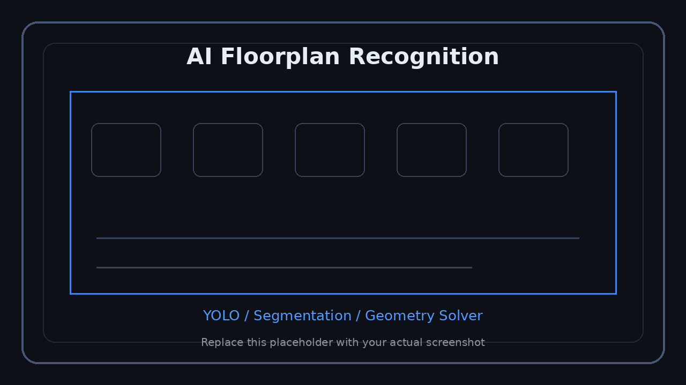

<p align="right">
  <a href="../../en/technical/ai-floorplan.md">US English</a> &nbsp;|&nbsp;
  <a href="../../ko/technical/ai-floorplan.md">KR 한국어</a> &nbsp;|&nbsp;
  <a href="../../ja/technical/ai-floorplan.md">JP 日本語</a>
</p>


# AI Floorplan Recognition

This document describes the AI/CV pipeline that converts 2D floorplan images into structured data for review and UE5 runtime generation.

<p align="center">
  
</p>
<p align="center"><sub>Screenshot slot: YOLO-based floorplan recognition</sub></p>

> Place model outputs, wall masks, opening masks, and before/after review screenshots here.

---

## Goal

The AI recognition module extracts the following structural elements from a floorplan image.

| Target | Description |
|---|---|
| Wall | Wall region, centerline, thickness, and junctions |
| Door | Door position, rotation, gap, and opening |
| Window | Window position, length, sill, height, and type |
| Room | Room polygon, area, and label |
| Scale | Real-world conversion using `mm_per_px` |

---

## Recognition Pipeline

```text
Input Planterior Image
	-> Preprocess
		-> Crop
		-> Deskew
		-> Contrast Enhancement
		-> OCR Text / Dimension Mask
		-> Inpaint
	-> Recognition Backend
		-> YOLO-based Detection / Segmentation
		-> Wall / Door / Window Candidates
	-> Geometry Solver
		-> Skeletonize
		-> Vectorize
		-> Junction Merge
		-> Opening Binding
		-> Room Closure
	-> Confidence Aggregator
	-> Validation Gate
	-> Review Payload
```

---

## Why YOLO

YOLO-style detection and segmentation models are used to identify structural candidates such as walls, doors, and windows from high-resolution floorplan images.

The YOLO recognition backend is responsible for:

- wall region or centerline candidate extraction
- door/window candidate detection
- opening class classification
- confidence scoring
- producing candidates for the Geometry Solver

The model output is not used directly for 3D generation. It is stabilized by geometry processing and user review before UE5 generation.

---

## CUDA / GPU Optimization Direction

The training and inference pipeline can be optimized with CUDA-based GPU acceleration.

| Technology | Purpose |
|---|---|
| cuDNN | Accelerates convolution, normalization, and activation operations |
| cuBLAS | Accelerates matrix multiplication and linear algebra operations |
| AMP Mixed Precision | Balances training accuracy and speed using FP16/FP32 |
| NVIDIA DALI | Reduces image decoding, resizing, and normalization bottlenecks |
| TensorRT | Optimizes FP16 inference, kernel fusion, and memory reuse |
| NPP | GPU-accelerated resizing, denoising, and contour refinement |

> Note: This repository is documentation-only for portfolio purposes. The private implementation is not included.

---

## Review-First Design

```text
AI Detection
	-> Wall Review
	-> Opening Review
	-> Final Annotation
	-> UE5 Runtime Generation
```

This design improves reliability because floorplan formats vary heavily, and small coordinate errors can break wall, floor, and ceiling generation.

---

## Output Contract

```json
{
	"job_id": "job_xxx",
	"scale_id": "scale_xxx",
	"mm_per_px": 8.741,
	"walls": [],
	"doors": [],
	"windows": [],
	"rooms": [],
	"next_review": "wall"
}
```

The UE5 Annotation Widget and Wall Generator consume this data for final 3D generation.
