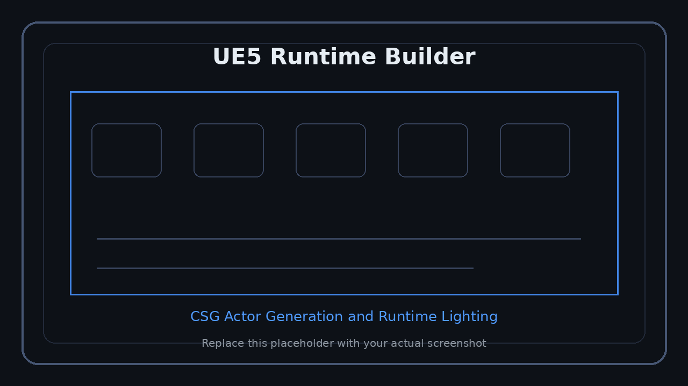
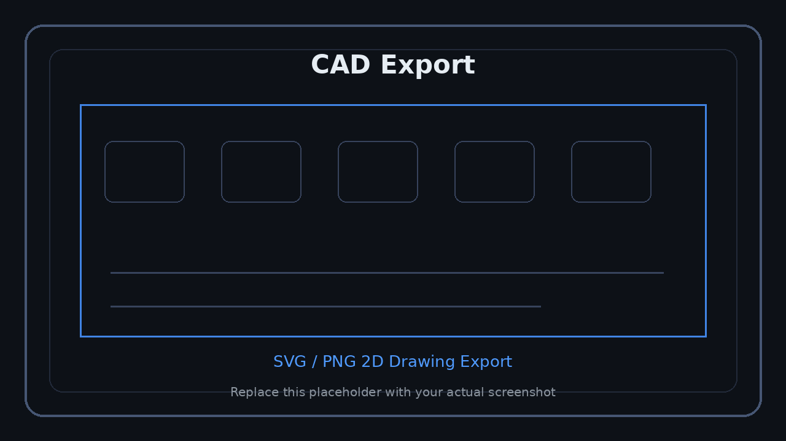

<p align="right">
  <a href="../../en/technical/ue5-runtime.md">US English</a> &nbsp;|&nbsp;
  <a href="../../ko/technical/ue5-runtime.md">KR 한국어</a> &nbsp;|&nbsp;
  <a href="../../ja/technical/ue5-runtime.md">JP 日本語</a>
</p>


# UE5 Runtime Builder

The UE5 Runtime Builder procedurally generates walls, floors, ceilings, doors, windows, furniture, and lighting from reviewed floorplan data.

<p align="center">
  
</p>
<p align="center"><sub>Screenshot slot: UE5 runtime 3D generation</sub></p>

> Place screenshots of generated rooms, walls, floors, ceilings, windows, doors, lighting, and furniture here.

---

## Core Components

| Module | Role |
|---|---|
| Annotation Widget | Converts reviewed data into generation payloads |
| Wall Generator | Generates CSG walls, floors, ceilings, windows, and room geometry |
| Runtime CSG Actor | Builds procedural mesh boxes at runtime |
| Door Spawner | Spawns door Blueprint actors with position, rotation, and scale |
| AutoPlace Manager | Converts AI furniture placement output into UE actors |
| Interior Formula | Applies room-specific finishes and structures |
| Ceiling Light Library | Spawns lighting Blueprints based on room type and size |

---

## Generation Flow

```text
Reviewed JSON
	-> Source Pixel Coordinates
	-> mm_per_px
	-> World Centimeter Conversion
	-> Wall / Floor / Ceiling CSG Spawn
	-> Door / Window Actor Spawn
	-> Room Matching
	-> Interior Formula Apply
	-> Furniture Placement
	-> Runtime Lighting
```

---

## Coordinate Systems

| Coordinate System | Unit | Usage |
|---|---|---|
| Source Image Pixel | px | backend detection and review payload |
| Widget Local Space | px | UE5 annotation UI |
| World Centimeter | cm | UE5 runtime actor generation |

```text
mm_per_px = known_length_mm / measured_length_px
cm_per_px = mm_per_px * 0.1
```

---

## Runtime Stability

| Issue | Protection |
|---|---|
| Z-coordinate drift | floor/wall/ceiling Z resolvers are kept as the single source of truth |
| Z-fighting | placeholder hiding, null material prevention, collinear filler skipping |
| Blueprint placeholders | automatically hides BasicShapeMaterial placeholder meshes |
| Window fallback visibility | invisible fallback CSG cube |
| Null material | material fallback or spawn skip |
| Wall/opening mismatch | user review and wall hash based opening revalidation |

---

## CAD Export

<p align="center">
  
</p>
<p align="center"><sub>Screenshot slot: CAD SVG/PNG export</sub></p>

> Place screenshots of exported 2D drawings, SVG/PNG results, or dimension labels here.

The reviewed annotation can be exported as CAD-style SVG/PNG.

Supported data:

- wall segments
- door positions and rotations
- window segments
- room polygons
- furniture markers
- area information
- SVG / PNG export

---

## DLSS / Runtime Rendering

For high-resolution real-time interior review, the runtime can support:

- DLSS upscaling
- Frame Generation on supported environments
- dynamic lighting
- SSGI / SSR based indoor rendering
- movable lighting for runtime-spawned actors
