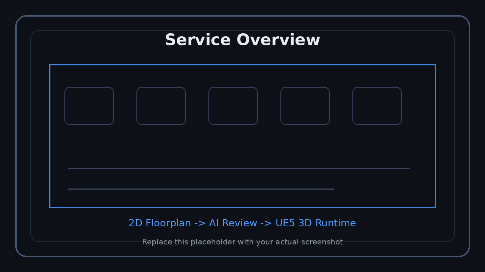
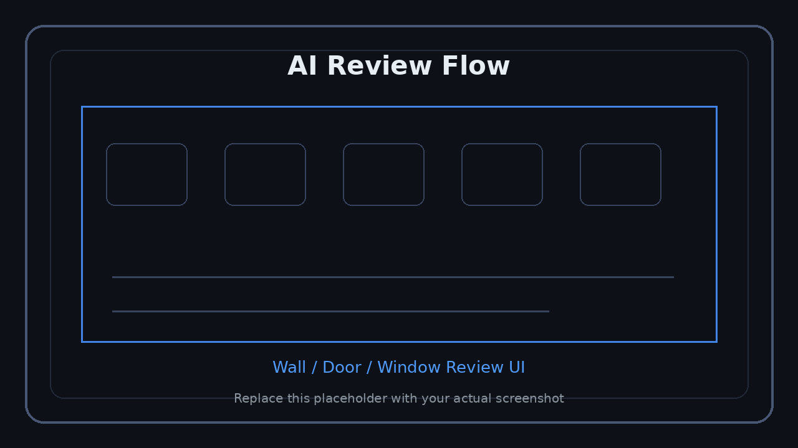
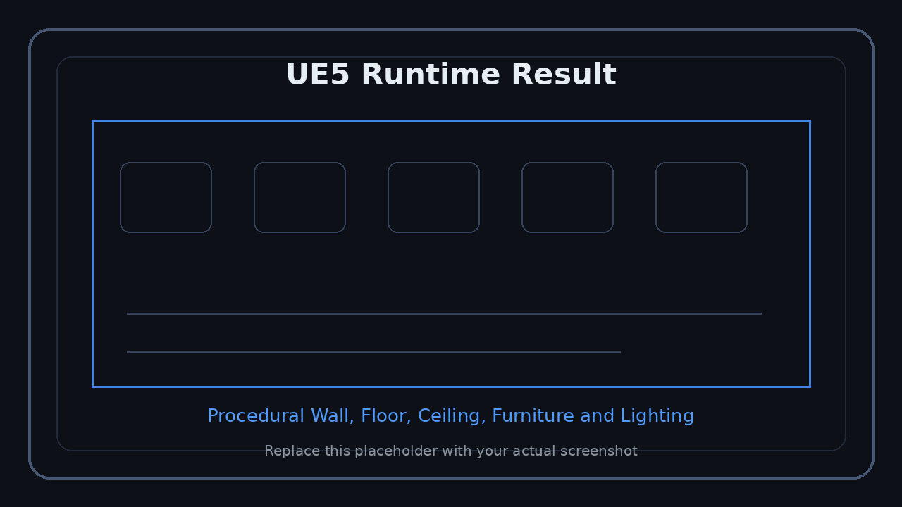

<p align="right">
  <a href="../en/README.md">US English</a> &nbsp;|&nbsp;
  <a href="../ko/README.md">KR 한국어</a> &nbsp;|&nbsp;
  <a href="../ja/README.md">JP 日本語</a>
</p>


# FloorplanSP

**FloorplanSP** は、2Dマンション間取り画像を入力として、AI解析、ユーザー確認、Unreal Engine 5 による3D室内空間の自動生成、AI家具配置、CAD出力までをつなぐ統合パイプラインです。

> このリポジトリはポートフォリオ公開用のドキュメントリポジトリです。実際のプロダクションソースコードは含まれていません。  
> FloorplanSPはAWSベースのクラウドインフラを利用し、SaaSバックエンド運用、APIアクセス、ストレージ拡張、AI inference worker分離を想定した構成です。

> このリポジトリはポートフォリオ公開用のドキュメントリポジトリです。実際のソースコードは含めず、スクリーンショットと技術説明で構成します。


---

## Tech Stack

> 以下のスタックは、FloorplanSP内で各技術が担当した役割を基準に整理しています。

### ENGINE

<p>
	
</p>

| 技術 | プロジェクト内の役割 |
|---|---|
| Unreal Engine 5.5 | 3D室内空間のランタイム生成、リアルタイムプレビュー、UI/入力処理 |
| UE Procedural Mesh / Runtime CSG | 壁、床、天井、filler、内装仕上げのプロシージャル生成 |
| UE UMG / Slate | 図面確認UI、wall/opening review、final annotation editor |
| Dynamic Lighting | ランタイム生成actor向けSkyLight、DirectionalLight、Point/RectLight |
| DLSS / Frame Generation対応 | 高解像度3D室内空間のリアルタイム確認最適化 |

### CLIENT / LANGUAGE

<p>
	
</p>

| 技術 | プロジェクト内の役割 |
|---|---|
| C++ | UE5ランタイム中核、WallGenerator、DoorSpawner、AutoPlaceManager、API subsystem |
| Blueprint | 窓、ドア、照明、家具などの視覚アセットとUE Editor設定 |
| Python | AI解析サーバー、FurnitureAIデータセット生成/学習、CVパイプライン |
| PyQt6 | AI家具配置用の手動アノテーター |
| HTML / CSS | FastAPI lightweight dashboardとドキュメントUI |

### BACKEND / SAAS

<p>
	
	
	
</p>

| 技術 | プロジェクト内の役割 |
|---|---|
| FastAPI | UE5クライアントと通信するSaaS APIサーバー |
| JWT Access Token | ログイン後のAPI認証 |
| Refresh Token Rotation | セッション維持とrefresh token再利用検出 |
| SQLite | 初期SaaS/ローカル運用向けuser、session、project、job保存 |
| Rate Limit / Audit Log | API濫用防止とユーザー操作記録 |
| Multipart Upload | 間取り画像アップロード |
| OpenAPI / Swagger | APIテストとドキュメント |
| Docker | デプロイ候補および実行環境固定 |

### AI / COMPUTER VISION

<p>
	
	
	
</p>

| 技術 | プロジェクト内の役割 |
|---|---|
| YOLO / Ultralytics Hook | 壁、ドア、窓などの構造要素候補検出 |
| Instance Segmentation | 構造要素をmaskベースで解析 |
| OpenCV | crop、deskew、Canny、Hough、CLAHE、inpaint、contour処理 |
| EasyOCR | 寸法テキスト、text mask、scale候補抽出 |
| Geometry Solver | wall vectorization、junction merge、opening-wall binding、room closure |
| Confidence Aggregator | model、snap、angle、binding、OCRスコアの統合 |
| Validation Gate | AUTO_OK、NEEDS_REVIEW、FAILEDなどを判定 |
| Florence-2 / SAM2 / Grounded-SAM2 | runtimeではなく学習/ラベリング補助用offline tool |

### FURNITURE AI

<p>
	
	
	
</p>

| 技術 | プロジェクト内の役割 |
|---|---|
| PyQt6 Annotator | 家具配置sceneの手動アノテーション |
| Synthetic Dataset Generator | rectangular / L-shape roomとrecipeベースのscene生成 |
| Variation Generator | reference sceneからpyeong-size variations生成 |
| Raster + Token Encoding | wall/door/window/interior rasterと構造token |
| Transformer Encoder-Decoder | 部屋構造を条件にfurniture token sequenceを生成 |
| AdamW / Cosine Warmup | 学習最適化 |
| Visualization Output | GT vs prediction PNG可視化 |

### GPU / ACCELERATION

<p>
	
	
	
	
	
</p>

| 技術 | プロジェクト内の役割 |
|---|---|
| CUDA | 学習/推論演算のGPU並列処理基盤 |
| cuDNN / cuBLAS | 畳み込み、行列積、正規化、活性化演算の高速化 |
| AMP FP16/FP32 | 学習速度と精度のバランスを取るmixed precision |
| NVIDIA DALI | YOLOデータロード/前処理ボトルネックをGPUパイプラインへ移動 |
| TensorRT FP16 | 推論最適化、kernel fusion、memory reuse |
| NPP | GPU画像resize、denoise、contour補正 |
| DLSS | UE5 viewerの高解像度レンダリング最適化 |

### DATA / STORAGE

<p>
	
	
	
</p>

| 技術 | プロジェクト内の役割 |
|---|---|
| JSON | reviewed generation payload、project state、annotation save file |
| SQLite | SaaS user/session/project/job metadata |
| Local User Storage | user_idベースのupload、preprocess、structure、project artifact保存 |
| SVG / PNG Export | 確認済み図面のCAD風出力 |
| Manifest Files | preprocess、dataset、training結果追跡 |

### ETC

<p>
	
</p>

| 技術 | プロジェクト内の役割 |
|---|---|
| Git / GitHub | ポートフォリオ文書化とバージョン管理 |
| Visual Studio | UE5 C++開発 |
| VS Code | Python/FastAPI/FurnitureAI開発 |
| Windows x64 | UE5クライアントのターゲット環境 |
| pytest | バックエンドおよびパイプラインテスト |


---

## Project Overview

FloorplanSPでは、ユーザーが間取り画像をアップロードすると、サーバーが構造要素を解析し、UE5クライアント上で壁、ドア、窓、部屋領域を確認した後、確認済みデータをもとに3D空間をプロシージャルに生成します。

<p align="center">
  
</p>
<p align="center"><sub>スクリーンショット領域: サービス全体フロー</sub></p>

> ログイン、プロジェクト選択、画像アップロード、AI確認、3D生成の流れを配置してください。

### 主な機能

| 機能 | 説明 | 詳細 |
|---|---|---|
| AI間取り認識 | 2D図面から壁、ドア、窓、寸法線などを抽出 | [AI間取り解析](./technical/ai-floorplan.md) |
| SaaSバックエンド | 認証、セッション、プロジェクト、job、scale、確認状態を管理 | [SaaSバックエンド](./technical/backend-saas.md) |
| UE5ランタイム生成 | 確認済み構造データから壁、床、天井、窓、ドア、照明、家具を生成 | [UE5ランタイムビルダー](./technical/ue5-runtime.md) |
| AI家具配置 | 家具配置データセット生成、アノテーション、Transformer学習 | [AI家具配置モデル](./technical/furniture-ai.md) |
| CAD出力 | 確認済み図面をSVG/PNGとして出力 | [UE5ランタイムビルダー](./technical/ue5-runtime.md#cad-export) |

---

## Runtime Flow

```text
User Login
	-> Project Create / Load
	-> Floorplan Image Upload
	-> Scale Confirm
	-> AI Structure Detection
	-> Wall Review
	-> Opening Review
	-> Final Annotation
	-> UE5 Runtime 3D Generation
	-> Furniture Auto Placement
	-> CAD Export
```

<p align="center">
  
</p>
<p align="center"><sub>スクリーンショット領域: AI確認UI</sub></p>

> スケール設定、壁確認、ドア/窓確認画面を配置してください。

<p align="center">
  
</p>
<p align="center"><sub>スクリーンショット領域: UE5 3D結果</sub></p>

> 生成された壁、床、天井、ドア、窓、照明、材質、家具を表示してください。

---

## Architecture

```text
2D Floorplan Image
	-> FastAPI SaaS Backend
		-> Preprocess
		-> Scale Manager
		-> YOLO / Recognition Backend
		-> Geometry Solver
		-> Validation Gate
		-> Review JSON
	-> UE5 Client
		-> Annotation Widget
		-> Wall Generator
		-> Runtime CSG Actor
		-> Door / Window / Furniture Spawner
		-> CAD Export
	-> Furniture AI
		-> Dataset Generator
		-> PyQt Annotator
		-> Transformer Training
```

---

## Repository Policy

この公開リポジトリにはソースコードを含めません。

含める内容:

- プロジェクト概要
- システムアーキテクチャ
- 機能別技術説明
- スクリーンショット領域
- ポートフォリオ向け技術スタック
- 今後の拡張計画

---

## Technical Documents

- [AI間取り解析](./technical/ai-floorplan.md)
- [SaaSバックエンド](./technical/backend-saas.md)
- [UE5ランタイムビルダー](./technical/ue5-runtime.md)
- [AI家具配置モデル](./technical/furniture-ai.md)
