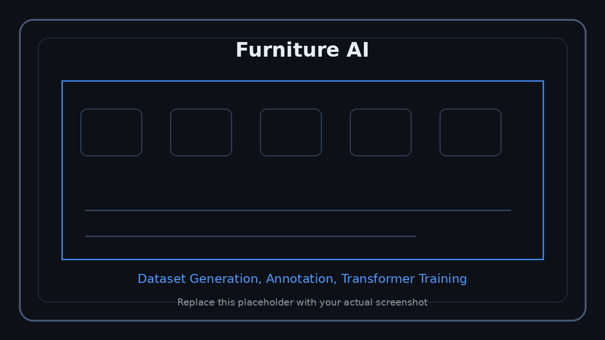

<p align="right">
  <a href="../../en/technical/furniture-ai.md">US English</a> &nbsp;|&nbsp;
  <a href="../../ko/technical/furniture-ai.md">KR 한국어</a> &nbsp;|&nbsp;
  <a href="../../ja/technical/furniture-ai.md">JP 日本語</a>
</p>


# AI家具配置モデル

AI家具配置プロジェクトは、部屋構造データをもとに家具をどこに配置するかを学習するPythonベースのプロジェクトです。

<p align="center">
  
</p>
<p align="center"><sub>スクリーンショット領域: AI家具配置データセットと学習</sub></p>

> PyQt6アノテーター、生成されたscene JSON、学習ログ、予測可視化画像を配置してください。

---

## 目的

このモジュールはPlanterior AIの自動家具配置機能のために、以下を提供します。

- 家具配置用scene dataset生成
- PyQt6ベースの手動アノテーション
- synthetic room layout生成
- reference sceneベースのvariation生成
- Transformerベースのautoregressive家具配置モデル学習
- 予測結果の可視化

---

## Data Pipeline

```text
PyQt6 Annotator
	-> scene_*.json
	-> manifest.json
	-> FurnitureSceneDataset
	-> Scene Tokens
	-> Raster Tensor
	-> Furniture Token Sequence
	-> FurnitureTransformer Training
	-> Checkpoint / Visualization
```

---

## 入力データ

モデルは構造tokenとraster入力を併用します。

| 入力 | 説明 |
|---|---|
| Scene Tokens | 壁、ドア、窓を構造化tokenで表現 |
| Raster Tensor | wall、door、window、interiorチャンネル |
| Room Metadata | room type、size、pyeong groupなど |

例:

```text
[type, x1, y1, x2, y2, thickness]
```

---

## 出力データ

モデルは家具をautoregressive token sequenceとして生成します。

```text
[category, cx, cy, width, depth, rotation]
```

家具1つを6 tokenで表現し、安定した生成のため最大家具数を制限します。

---

## FurnitureTransformer

```text
Raster 4ch Image
	-> Raster CNN
	-> CLS Embedding

Scene Tokens
	-> Scene Token Embedding

CLS + Scene Embeddings
	-> Transformer Encoder

Furniture Tokens
	-> Transformer Decoder
	-> Next Furniture Token Prediction
```

基本特性:

| 項目 | 値 |
|---|---|
| Model | Transformer Encoder-Decoder |
| Raster Size | 256 x 256 |
| Input Channels | wall / door / window / interior |
| Coordinate Bins | 256 |
| Rotation Bins | 24 |
| Max Furniture | 32 |
| Training | AdamW, cosine warmup, teacher forcing |

---

## Dataset Generation

### Synthetic Generator

- rectangular room生成
- L-shape room生成
- living room / bedroom / kitchen / office / dining room recipe適用
- sofa、bed、wardrobe、desk、TVなどのcategoryベース配置規則

### Variation Generator

- 人が作成したreference sceneを基準にする
- pyeong-size variationsを生成
- room geometryをscale
- wall attachment関係を保持
- position / rotation jitterを適用
- review metadataでapprove / rejectを管理

手動ラベルデータが少ない初期段階でもデータセットを拡張できます。

---

## Planterior AIとの接続

```text
Confirmed Room Structure
	-> Furniture AI Input
	-> Category / Position / Size / Rotation Prediction
	-> UE5 AutoPlace Manager
	-> Furniture Actor Spawn
```

この公開ポートフォリオ文書では、データ生成、アノテーション、学習、サンプル予測までを範囲とし、production inference API連携は今後の拡張として分離します。

---

## 今後の拡張

- production inference CLI
- FastAPI inference endpoint
- UE5 AutoPlaceManagerとの直接連携
- collision / accessibility constraint
- ユーザー嗜好ベースの家具スタイル推薦
- 実際のマンション間取りデータセット拡張
