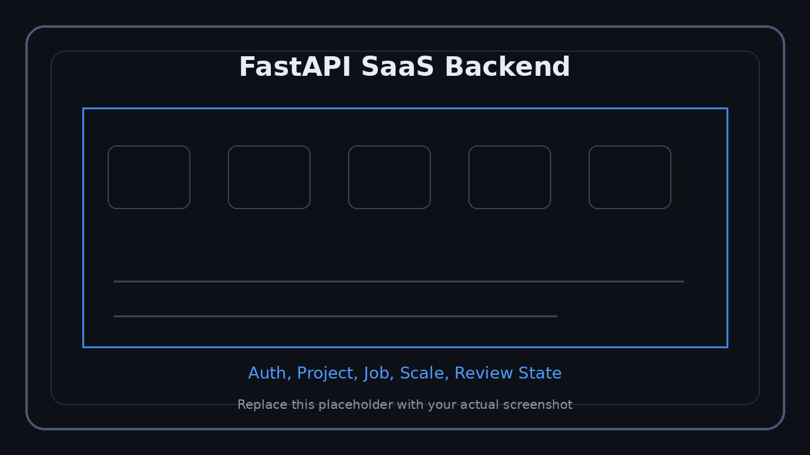

<p align="right">
  <a href="../../en/technical/backend-saas.md">US English</a> &nbsp;|&nbsp;
  <a href="../../ko/technical/backend-saas.md">KR 한국어</a> &nbsp;|&nbsp;
  <a href="../../ja/technical/backend-saas.md">JP 日本語</a>
</p>


# SaaS 백엔드

FloorplanSP 백엔드는 FastAPI 기반 서버로, AI 도면 분석 파이프라인과 UE5 클라이언트의 프로젝트 저장/복원을 연결합니다.

<p align="center">
  
</p>
<p align="center"><sub>SaaS 백엔드 대시보드 및 API 흐름 스크린샷 영역</sub></p>

> 로그인, 프로젝트 목록, job 상태, API 문서 또는 서버 로그 화면을 배치하세요.

---

## 서버 역할

| 영역 | 역할 |
|---|---|
| Auth | 회원가입, 로그인, access JWT, refresh token rotation |
| Session | 세션 관리, revoke, 다른 위치 로그인 감지 |
| Project | 프로젝트 생성, 저장, 로드, quota 검증 |
| Job | 이미지 업로드, job ownership, 상태 관리 |
| Scale | 사용자 확정 scale 저장, `mm_per_px` 관리 |
| Structure | wall review, opening review, final annotation 저장 |
| Storage | 사용자별 durable storage 관리 |
| Security | rate limit, audit log, token masking |

---

## Runtime Pipeline

```text
UE5 Client
	-> Login
	-> Project Create / Load
	-> Floorplan Upload
	-> Scale Confirm
	-> Preprocess
	-> Structure Detect
	-> Wall Confirm
	-> Opening Confirm
	-> Final Annotation Save
```

---

## API Endpoint 예시

| Method | Path | 설명 |
|---|---|---|
| POST | `/api/v1/auth/login` | 로그인 |
| POST | `/api/v1/auth/refresh` | refresh token rotation |
| GET | `/api/v1/projects` | 프로젝트 목록 |
| POST | `/api/v1/projects` | 프로젝트 생성 |
| POST | `/api/v1/floorplan/upload` | 도면 이미지 업로드 |
| POST | `/api/v1/scale/user-confirm` | 사용자 scale 확정 |
| POST | `/api/v1/structure/detect` | 구조 인식 및 wall review 시작 |
| POST | `/api/v1/structure/user-confirm` | wall 또는 opening 검수 저장 |
| GET | `/api/v1/structure/{job_id}` | 저장된 구조 검수 데이터 조회 |

---

## Wall -> Opening -> Done Review Flow

```text
structure/detect
	-> next_review = wall

structure/user-confirm, review_stage = wall
	-> confirmed_walls 저장
	-> wall_hash 계산
	-> opening 후보 병합
	-> next_review = opening

structure/user-confirm, review_stage = opening
	-> confirmed_doors / confirmed_windows 저장
	-> final_annotation 생성
	-> next_review = done
```

`wall_hash`를 사용해 벽 변경 후 기존 문/창문 검수 데이터가 더 이상 유효한지 판단합니다.

---

## Storage Policy

```text
data/users/<user_id>/
	account.json
	uploads/
	sessions/
	preprocess/
	structure/
	projects/
```

중요 정책:

- `user_id` 기반 저장 경로를 canonical storage로 사용
- `slug`는 표시 또는 legacy fallback 용도
- 모든 job/project API는 ownership check 필요
- active scale은 active job에 연결되어 있어야 함
- 운영 모드에서 anonymous default user 사용 금지

---

## Security

SaaS 운영을 위해 다음 정책을 적용합니다.

| 정책 | 설명 |
|---|---|
| Access JWT | 짧은 TTL의 access token |
| Refresh Rotation | refresh token 재사용 감지 시 session family revoke |
| Ownership Check | 모든 job/project 접근 권한 검증 |
| Rate Limit | API 남용 방지 |
| Audit Log | 사용자 행동 기록 |
| Token Masking | token, password, raw auth response 로그 출력 방지 |

---

## Production 확장 계획

현재 구조는 초기 SaaS 및 로컬 운영에 적합하며, 대규모 운영 시 다음 확장이 필요합니다.

- SQLite -> PostgreSQL migration
- process-local queue -> Redis / RabbitMQ / SQS
- AI inference worker 분리
- object storage 연동
- monitoring / tracing / alerting
